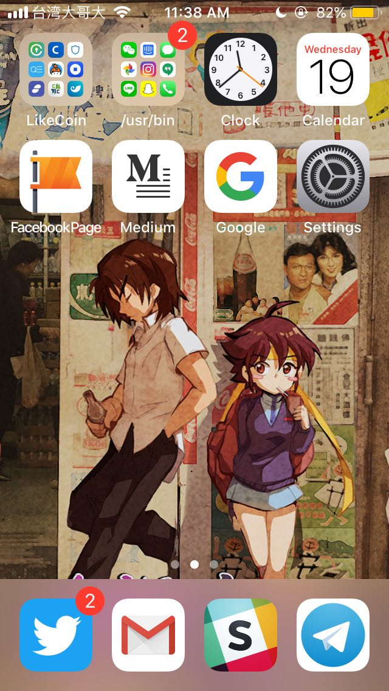

# 20‧30‧40：三代 iPhone SE 男

跟兩位也是從事資訊科技的朋友在東京椎名町電車站北口晚飯，在日港人、在地日人、出差港人，年紀跨越了20、30、40。無意中發現，擱在桌上的手機，三台都是 iPhone SE。SE 在 iPhone 市場的佔有率 4.74%，假設蘋果的市場佔有率為 50%，三個人三台 SE 的機率為 20000 分之 1。正好當晚凌晨蘋果舉行[產品發佈會](https://www.apple.com/apple-events/september-2018/)，市場早預期 SE 會消失，20 男打趣說飯後要趁發佈會開始前，多買一台。

幾人並不富有，但負擔最高端的 iPhone 總算綽綽有餘，沒追上更大更炫更高端的型號，是對產品發展的方向不認同，或者至少，不甚了了。大容量、大屏幕、輕薄當然都是好，但當容量已足夠，屏幕已大得無法單手操作，薄但電池永遠不夠用，真的還要追上去麼。開機就得被迫自拍，我寧願用指紋解鎖；長期帶著「尿袋」，我寧可加厚機身容納足夠的電池，更理想的是像舊式手機般可換電池。我不是矯情懷舊，只是確實新不如舊，寧可不變就好。

欠著人情的我請客，三人三小時杯盤狼藉，埋單 7000 yen，港幣 490。打從八百伴在沙田開業就有日本菜很貴的概念，到了今天，它貴價依然——相對八十年代香港而言。一般港人如我20 年前到日本吃著 700 yen 的拉麵，20年後中港各樣都漲價以倍計，部分樓價能上十倍，但到日本依然在吃 700 yen 的拉麵，不用到中產的程度，都會覺得便宜，或者說，根本就是超現實。

大學教授大概要出來指出我的無知了，日本泡沫爆破後，20 年多年來經濟一蹶不振，沒通脹甚至有通縮，在經濟學的角度是壞事。只是，教授的理論解釋不了，眼前 30 出頭的日本年青人，面對穩定的物價和租金，生活踏實安穩，何壞之有；而看著樓價租金永遠無節制向上的年輕港人，總是生活在焦慮中，好在哪裡。20 男技術了得，帶著筆電，去過十個國家遊牧遠端工作，就是沒有理由留在香港，這個幾乎全球唯一一身好本領都沒法自力更生安居樂業的地方。20 男暫時安頓在東京，以在香港連劏房都租不起的費用，租住 250 平方呎的單人間。他問過房東租約期滿後會不會大幅加租，房東訝異說，那是黑社會才會幹的事。

30 男問到 20 男日後會否回港，他說還不知道。類似的話我聽過不少，一般而言，年輕人在外安頓了只會回港放假，中年離開的才會有回流的想法。聊到去留的問題，20 男客氣說也欣賞有能力離開的 40 男選擇留港貢獻，但 40 男心知，選擇留下來是真的，說到貢獻就太言重，說得出口的，是志氣夠盛，又或者，臉皮夠厚。留下來，不代表認同或者喜歡那種只知追求人口規模經濟增長的模式，正好相反，因為不認同，才更覺得需要留著，即使沒能力改變甚麼，至少一起捱，說穿了不過賤骨頭。借楊絳先生的話：

> `「我們不願意逃跑，不願意去父母之邦，撇不開自家人。我國是國恥重重的弱國，跑出去仰人鼻息做二等公民，我們不願意。」`

其實，豈只是三代 20 30 40 SE 男，對於任何理性的人，明明足夠就好，很多時只是[被推著走，跟著生活流](https://www.youtube.com/watch?v=xwQ0TdywqpA)，[為免犧牲，情願被同化](https://www.youtube.com/watch?v=4t17Z7WlU7c)。

回到 AirBnb，發佈會過後，蘋果網站上的 iPhone SE 消失了，無聲無息地。避而不談也好，根本不值得提起也好，沒宣布停產。有說，SE 還會在發展中國家售賣，只是**追求顧客質量的本土市場容不下低端產品**而已。

＃刊於《明報﹣星期日生活》 2018.09.16 [chungkin Express](https://ckxpress.com/20-30-40/) 專欄



