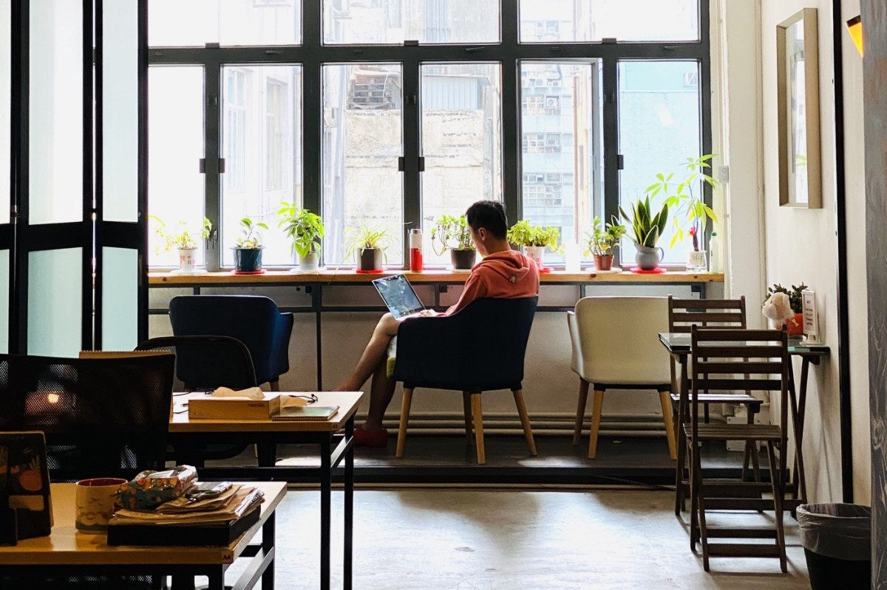

# 2020.04.01 有些事現在不做一輩子都不會做了

四月。2020 過掉 1/4。[哥哥死忌](https://youtu.be/RKhtQ5iWRQk)。愚人節已過氣，沒有人想得出比現實更荒唐的事。

不知道該說世界變得很快還是變得很慢。五週沒聊，世界翻天覆地；但同時所有事情的節奏都慢了下來，人和地球都多了休息。常聽人祈求「回復正常」，嚴格來說只是「回復原狀」，至於原狀比較正常還是減慢後的生活節奏，增加後的個人空間才比較正常，也不好說。反正，希望大家身體健康。

慶幸疫情對我這些[本來就活在賽博空間](https://ckxpress.com/radical-management-1/)的，影響相對傳統行業小一點，只不過（被）取消了所有出差，包括本來四、五月兩個歐洲的[國際研討會](https://summit.creativecommons.org/)和自以為可以有的 stay behind 逛逛，[台北書展](https://ckxpress.substack.com/p/20200204-)從推遲到乾脆取消。

辦公室從[捨不得的沙田](https://ckxpress.com/satellite-city/)搬到了[新蒲崗](https://ckxpress.com/hk-it-policy/)，再不能像前陣子每天走路萬多步上下班、聽 [Podcast](https://open.spotify.com/episode/0xr8FKrXzfgRk9j5YUX9R6)。幸好我一向喜歡如新蒲崗這種稍為離開地鐵站的區，比較好玩好吃；雖然現在鑽石山站出去就到了，除了[得龍](https://www.taklung.com.hk/)沒了暫時還算保持得不錯。

順著大環境，我決定乾脆今天開始放假兩個月，想趁機縮短那條永遠看不完的 reading list，和寫書。是的，[之前](https://ckxpress.substack.com/p/20200204-)說考慮寫本關於[區塊鏈共和國](https://ckxpress.com/republic-of-blockchain/)的書，決定實行了，畢竟，[有些事現在不做一輩子都不會做了](https://youtu.be/2F0m58YIMPs)。

放假兩個月，其實另一個考慮是幫資源很緊的基金會省點錢，工資我領完捐回公司，正好開源社群這週有個 matching fund，配對捐給我們的錢。配對基金的機制並非固定 $1 對 $1 而是鼓勵多人參與，相對於一個人捐一萬元，一萬人捐一元所得的配對份額會多得多。暫時 [LikeCoin](https://like.co/) 的成績是 USD74 捐款，USD96 配對。

有空的話，希望有 Github 帳號的朋友能幫忙抽點時間去[捐款](https://gitcoin.co/grants/634/likecoin-republic-of-liker-land)。不用多，1 Dai—即 1 USD—就已經很好，能配對到不少。Dai 是種錨定美元的密碼貨幣，穩定兌 1 USD。大部分人手上沒有 Dai，但我可以幫手兌換，這可以當成是悶在家裡的學習。

照片是同事在新辦公室偷拍。新環境很不錯，可以開窗很重要，我排斥冷氣。

有人說我的小腿很 sexy，我姑且貼出來公諸同好，作為愚人節禮物。

