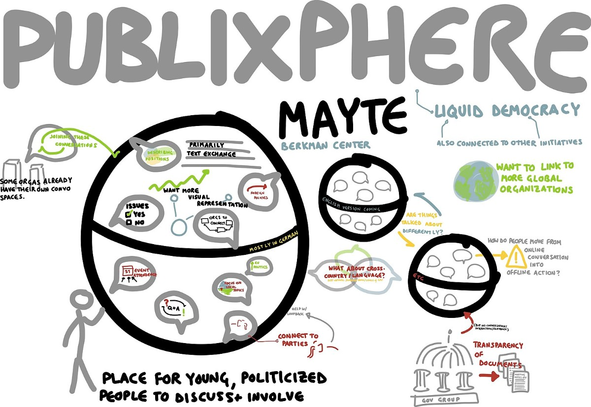

# 民主的再想像

上期&lt;[與唐鳳談流動民主](https://ckxpress.com/liquid-democracy-with-audrey-tang/)&gt;刊出後，有讀者吐槽文章標題黨，整篇沒解釋到底何謂流動民主，搞得他得自行 Google。我直說抱歉，一個不小心坐上了唐鳳的人氣列車，她太精彩，沒開始談流動民主就用光版面了。至於讀者自行 Google 我卻不感慚愧，沒甚麼比讀者進一步探索題材更讓我鼓舞了。互聯網上關於流動民主的中文討論很少，想閱讀更多建議可搜尋 “[Liquid democracy](https://en.wikipedia.org/wiki/Liquid_democracy)”。

### 民主制度千瘡百孔

雖然世人為了爭取民主搞得頭破血流，付出沉重代價，但我們心知，即使是西方國家，當下的代議政制依然問題多多。只不過，相對於體制以此作為極權護航的藉口，找尋更佳的民主實踐方式才是正確態度。

我曾經寫過&lt;[投票，最不民主](https://ckxpress.com/voting-is-the-least-democratic/)&gt;，提到昔日學生組織相信真理越辨越明，很堅持辯論得出共識而抗拒投票表決，畢竟缺少充分討論的投票，往往只是為節省時間讓少數服從多數的妥協，輕則眾人一起作出草率決定，重則淪為多數人的暴政。另一個投票「不民主」的原因在於，一旦選出民意代表，人民往往自覺功德圓滿，留給代議士操心，個人不再參與。說到這裡，定有人問，難道要回到古希臘的直接民主，事事讓所有人參與討論與投票麼。

介乎直接民主與代議政制的流動民主，正是要回應以上弊病。相對代議政制，流動民主從幾方面賦予人民更深入的參與：

一、可委託一個或以上代表，也可分不同程度；

二、可於不同時間，就不同議題，委託不同的代表；

三、可選擇自行就議案直接投票。

對代議政制期盼了幾十年的我們，很容易變得「夏蟲不可語冰」，難以想像流動民主的具體操作，我姑且嘗試以虛構故事說明。

### 理想國

試想像在理想國，相對於一人一票，每位選民獲分配 100 點「話語權」。理想國居民 Alice 認可 Bob 的政見、能力與誠信，於是把 100 點話語權全數委託給 Bob。豈料，理想國政府提出出賣人民的議案，Bob 竟然投下贊成票。不幸中之大幸是，Alice 不用等待四年後以選票懲罰 Bob，而是馬上把話語權轉走，這次分散信任，分別給 Carol 與 Dave 委託 60 點和 40 點話語權。出賣人民的 Bob，由於大量話語權被轉走，即時失去議員資格。

過了一陣子，理想國表決教育改革議案，Alice 認為教師出身的 Carol 比律師 Dave 對此更有心得，遂把 Dave 的 40 點話語權都委託給 Carol，對議案投出最有力一票。又過了一陣子，理想國討論反資訊科技滲透議案，屬 Alice 的專業範疇，於是 Alice 收回 100 點話語權自用，直接對議案作出表決。話語權點數像水一般流動，讓理想國人靈活地在不同時間，就不同議題，委託不同代表議決或自行表決；至於議員，則需時時刻刻聆聽人民訴求，確保自己持續反映委託者的權益。

聽上去很美好，具體實踐卻充滿未知之數。要如何讓人民理解，以甚麼方法簡單而高效分配話語權點數，如何避免短視的民粹式決策，通通是挑戰。這正好是區塊鏈以至其他科技登場的時候。

著名的 [Minecraft](https://ckxpress.com/minecraft-letter/)，遊戲類型稱為「沙盒」，讓玩家像神玩泥沙一般建構心目中的世界，Minecraft 的中文名是《我的世界》，在我的世界，我說了算。金融市場也有所謂沙盒的措施，提供模擬環境測試未經證實的金融產品，避免影響到現實世界。而我「過度翻譯」為「[區塊鏈共和國](https://ckxpress.com/republic-of-blockchain/)」的 Decentralized Autonomous Organization，即存活於區塊鏈，以代碼治理的共同體，則正好充當民主實驗的沙盒。

### 民主實驗的沙盒

我[跟唐鳳討教](https://ckxpress.com/liquid-democracy-with-audrey-tang/)憲法設計的[讚賞公民共和國](https://liker.land/)正是這樣的一個實踐。跟上述理想國略為不同，共和國裏的話語權跟日常交易用的[通證](https://ckxpress.com/from-value-to-price/)（「貨幣」）二合為一，可透過日常發表創作，贏取[讚賞公民](https://ckxpress.com/design-of-civic-liker-mechanism/)和其他讀者按讚以獲得。讚賞幣除了用作交易，更大的意義，在於體現了個人在國度中的話語權。另一個跟理想國的落差，是公民還不能直接投票，而必須委託出去授權代議，對共和國的各項議案投票。議案涉及的範圍可包括如何定義、判別和懲處[虛假訊息](https://ckxpress.com/taiwan-factcheck-center/)（「假新聞」）、內容農場、經濟方面如通脹率的調控，以至憲法修訂等等。上期之所以稱立國時的憲法版本爲「憲法[MVP](https://ckxpress.com/mvp/)（最小方案）」，是因為憲法很多元素還沒涵蓋，但確立了核心的流動民主機制，讓持分者能透過一個又一個議案，逐步完善整套憲法。

由於區塊鏈的沙盒特性，也由於內容天生的數位特質，再加上使用受眾相對熟悉科技產品和工具，給人第一印象十分《[黑鏡》](https://en.wikipedia.org/wiki/Black_Mirror)的流動民主管治，實際上公民已經天天放在口袋，時時握在手中。透過一個包裝成社交網絡的流動應用程式&lt;[Liker Land](https://like.co/in/getapp)&gt;，來自香港、台灣等地的九千多人，已把總體 76% 的話語權委託予[立場新聞](https://www.thestandnews.com/)、[Matters News](https://matters.news/)、[文化及媒體教育基金](https://www.cmef.org.hk/)、[國立臺北科技大學](https://www.ntut.edu.tw/)、[台灣事實查核中心](https://tfc-taiwan.org.tw/)、區塊鏈專家 [Forbole](https://www.forbole.com/)、資安專家 [Enyk](https://enyk.io/) 等代議，並已於上月通過[首項議案](https://likecoin.bigdipper.live/proposals/1)，增加代議議席及取消入閘機制，鼓勵素人參選代議。

雖然本地民主程度大幅落後先進國家，這場於港台首發的流動民主實驗卻走在最前沿，屬世界首例，既目標在區塊鏈上真正落實，也目標為人類民主實踐輸出寶貴經驗和參考數據。兄弟爬山，手足在物理世界爭取民主的同時，一場史無前例的民主實驗，正悄悄在賽博空間發酵。

\# 刊於《[明報﹣星期日生活](https://news.mingpao.com/pns/%e5%89%af%e5%88%8a/article/20200412/s00005/1586628540339/chungkin-express-%e6%b5%81%e5%8b%95%e6%b0%91%e4%b8%bb%e7%9a%84%e6%83%b3%e5%83%8f%e8%88%87%e5%af%a6%e8%b8%90)》 2020.04.12 [chungkin Express](https://ckxpress.com/) 專欄

