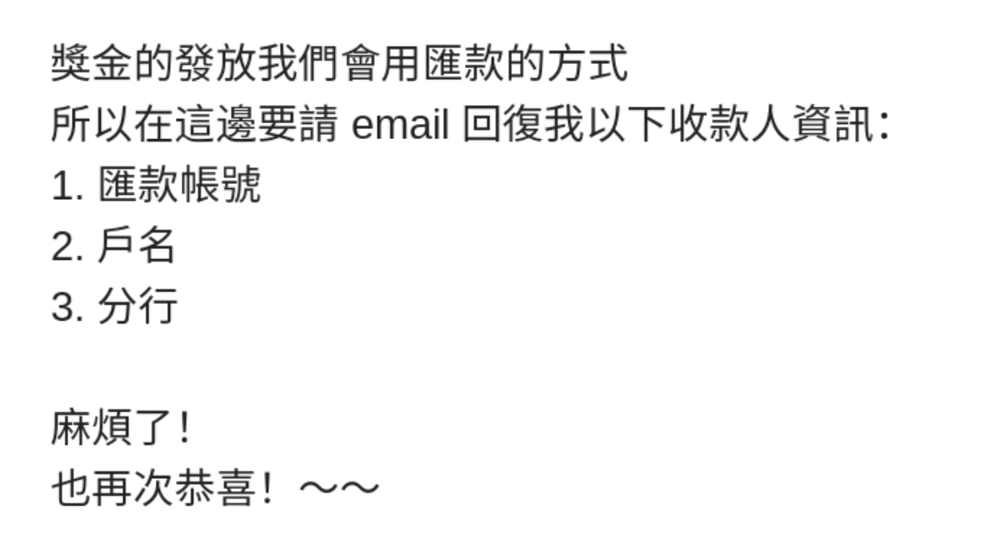

# \#ThisAttackComesFromTaiwan

也來寫幾句 \#來自台灣的攻擊。

我又想起去年六月[那天](https://www.bbc.com/zhongwen/trad/chinese-news-48362128)。台灣最大的創業加速器 [AppWorks](https://appworks.tw/) [demo day](https://www.youtube.com/watch?v=wG7YqbqDcyI&t=1s)，互動部分，台上的 [Alyssa](https://appworks.tw/team/alyssa-chen/) 對每個來自台灣以外的創辦人都問到，台灣有甚麼好，吸引過來創業。

答案當然是台妹呀（其實沒有人這樣說，但反正心裡肯定有想到就是了）、小吃呀、珍奶呀之類。可是我人比較正經，至少是[那天](https://www.bbc.com/zhongwen/trad/chinese-news-48362128)輕佻不起來，想到的直接就是[民主、自由、多元](https://matters.news/@ckxpress/%E8%87%B4%E5%8F%B0%E7%81%A3-%E9%A6%99%E6%B8%AF%E4%B8%8A-zdpuAykKmos4XiqyXmcVqkC6WUbYXTWofrwa27tjThiNQnAPU)。

但我要攻擊台灣的不是這個，想起而已，因為事情關於 AppWorks。

[LikeCoin](https://matters.news/@likecoin) 作為一個公益項目，推了一年多的「[讚賞公民](https://matters.news/@ckxpress/%E7%AD%94%E5%AE%A2%E5%95%8F-%E8%AE%9A%E8%B3%9E%E5%85%AC%E6%B0%91%E7%9A%84%E7%94%A2%E5%93%81%E8%A8%AD%E8%A8%88%E9%82%8F%E8%BC%AF-zdpuAzeWd2hsjDqorgvVSD2aTvovauituqSa83hJY1MHUfs5x)」計畫並無毛利，到手的收入全數給創作者，因此經常被問及怎樣賺錢，怎樣生存，而 AppWorks 作為創業加速器，自然更加會問到這個問題。這回姑且讓我反擊一下：AppWorks 其實比 LikeCoin 更「糟糕」，給亞洲各地的創業者各種資源，從法務、稅務、財務、人事諮詢、人脈介紹、基礎設施等，甚至免費午餐也不缺，卻居然費用全免，也沒有我最抗拒的各式官僚文件表格。

但我要攻擊的也不是這個，而是 AppWorks 尾牙的一件小事。

話說年初出席 AppWorks 尾牙，抽獎一籮籮，但我約了朋友，中途提前離開了，也沒放在心上。過了幾天，我已經完全忘掉尾牙更忘掉抽獎，卻收到陌生人來郵，說我中了一萬元讓我領。在我成長的世界，從小到大的教育（與教訓）告訴我們這種訊息百分百是詐騙，自我保護機制早已是反射動作，我的指頭已經要往刪除按下去之際，可能是因為身在台灣吧，我停了一下，再細讀一遍，搞清對方來歷，最後還真的領了一萬台幣。金額說少不少說多不多，但重點不在這裡，而是那種追債般追著你領獎的傻勁，和意識不到發冷郵件找人領獎金會被秒刪的可愛，讓我印象很深刻。

是為發生在台灣的一件小事。

說不定，是只會發生在台灣的小事。

