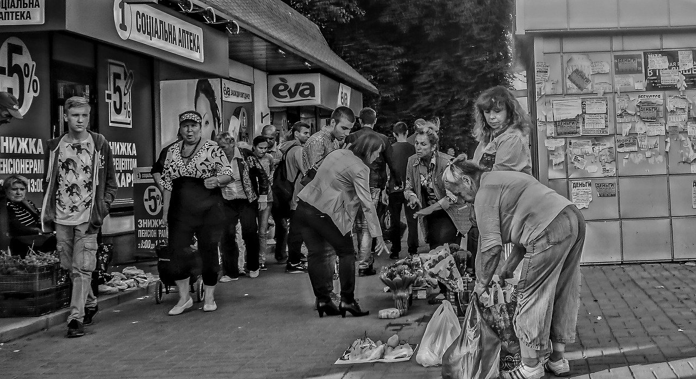

# 許願池：讓用戶販賣商品的 Matters 市集

[Matters](https://matters.news/) 和 [LikeCoin](https://like.co/) 都有體貼的用戶群，也有同一個煩惱：用戶老在問，你們怎麼賺錢？問題是尖銳的，出發點卻是窩心的，這反映用戶不是單向接收服務，也是在關心，在參與。

作為也是非常關心 Matters 的用戶，我許願想要的，是一個 **Matters 市集**。

內容有價、開放分享都是我的核心價值觀，有人質疑我矛盾，一方面主張創作者應得到報酬，另一方面奉行開放源碼、開放數據、開放政府、創用 CC ——我是 [Creative Commons](https://creativecommons.org/) 會員，個人網誌 [chungkin Express](https://ckxpress.com/) 17年來約 900 篇文章全部以 [CC-BY-SA](https://creativecommons.org/licenses/by-sa/4.0/) 授權，無須聯繫我就能直接取用。認為兩個價值觀矛盾的人，預設了付費是因為不付費就讀/看/聽不到，這種假設其實沿於上世紀，適用於實體世界；實物會因為 A 取得了而 B 就沒有，是零和關係，所以付費才能買到菜、吃到飯——搶購才能用到衛生紙。

但數位內容不一樣，[Being Digital](https://www.amazon.com/Being-Digital-Nicholas-Negroponte/dp/0679762906) 的核心是無限複製，而且成本趨向零，A、B、C、D 全都去讀一篇文章，不但不會讓文章數量減少，假如能像 Matters 般營運得宜，還可能因而提升文章的價值。在這個前題下，為了收費而把內容關起來，百害而無一利。事實上，「看不到的才會付費」是個從根本上錯誤的獎賞機制，它獎勵封閉，懲罰開放；只有在自己看不到內容時才掏錢的讀者，是在用行動告訴創作者：「請把內容收起來別讓我看吧。」

呃，我又跑題了，就此打住。以前寫過不少這話題討論如何「[左而不膠](https://ckxpress.com/creative-commons-likecoin/)」，有興趣的可[參考](https://ckxpress.com/?s=creative+commons)，比如《[404 Not found 遇得多 402有見過麼？](https://matters.news/@ckxpress/404-not-found-%E9%81%87%E5%BE%97%E5%A4%9A-402%E6%9C%89%E8%A6%8B%E9%81%8E%E9%BA%BC-bafyreih446zwis7iquztt75seiv66542olcd5ylauu5kp5cujkjqe2o5gy)》

還是直奔主題好了。想要個 **Matters 市集**，讓用戶自主掛單賣產品，像 [carousell](https://carousell.com/)，或者有些人比較熟悉的淘寶，又或者，因為都是內容搭配電商，更接近的類比是 [HKTVmall](https://ckxpress.com/on-tv/)。但以上都只是類比，Matters 市集理應跟以上三者都不一樣，才有意思吧。

我心目中的 **Matters 市集**，買賣雙方以創作者和內容愛好者為主，商品可以是 [@梁啟智](https://matters.news/@leungkaichihk) 的《香港第一課》[電子版](https://www.books.com.tw/products/E050062392)或[實體版](https://www.books.com.tw/products/0010844637)、 [@蕭雲](https://matters.news/@daybreakcloud) 的拍照服務、[@蕭芸安](https://matters.news/@sllenanhsiao) 的作曲服務、[@Sunline](https://matters.news/@sunline) 的文創用品、[@讚賞公民共和國](https://matters.news/@likecoin) 的讚賞公民，或者任何作者的「包養計畫」。雖然同樣是 c2c，但 **Matters 市集**的產品針對性高得多，買賣雙方的關係緊密得多，很可能本來就認識了，像小鎮上的街坊，除了一買一賣，雙方很可能本來就是鄰居，或是有著生活上各種交集。

以上我雖然說 HKTVmall 是相對淘寶、carouell 而言接近的類比，但跟我許願中的 **Matters 市集**還是很不一樣。我曾[吐槽 HKTVmall](https://ckxpress.com/on-tv/)，不是因為做電商有甚麼錯，也不是我看扁它做不成 —— 我可沒資格 —— 而是因為它大談內容產業對香港如何重要的理想後，在互聯網遠超大氣電波的年代，只因拿不到電視牌照就不再做內容而轉做電商。所謂 HKTV+mall，像「水溝油」般毫不相干，完全割裂，觀眾既沒法販賣商品，節目受眾跟商品定位也沒有關聯。

除了同樣是內容帶流量、電商帶毛利——其實 HKTVmall 只有開初的一小陣子是——我心目中的 **Matters 市集**幾乎是 HKTVmall 的相反，初心不忘，定位清晰，內容與商品高度重合，互相帶動，用戶關係緊密，商品由社群本身提供。當然，Matters 同樣可以出售官方商品，但既然 Matty 本身也是 Matters 用戶，整個模式還是不脫 c2c。

**Matters 市集**理應同時支持傳統貨幣和 LikeCoin，我雖然創辦 LikeCoin，但從來沒有取代傳統貨幣的主張，一直認為[兩者是共存、互補的](https://matters.news/@ckxpress/%E6%BC%82%E6%B5%81%E6%95%99%E5%AE%A4-iii-%E5%BE%9E%E9%9B%B6%E5%92%8C%E5%88%B0%E5%85%B1%E5%92%8C-zdpuB14QnJ6XypnxQ6kYmje5XjX5KdN9S53XEdMgeX4u8N4ir)，因為某些場景比如微支付傳統貨幣沒處理好，[某些價值如內容有價沒承載好](https://matters.news/@ckxpress/%E6%BC%82%E6%B5%81%E6%95%99%E5%AE%A4-ii-%E5%BE%9E%E5%83%B9%E5%80%BC%E5%88%B0%E5%83%B9%E6%A0%BC-zdpuAshJFdgUT9TC1NSY3F7CF8LYJZdneebJx21tgB34TTXAX)，於是設計出 LikeCoin。但在生活上的很多場景，比如請攝影師拍照一天，買一本完整的書，既然傳統貨幣解決得好（至於美國聯儲局無上限印鈔，是另一大話題了），現在的金流系統如 [Stripe](https://stripe.com/en-hk) 又那麼成熟，我自己都不認為得用上 LikeCoin 或者 Bitcoin 去取代。

說起買一本完整的書，我得回到許願初段的脈絡，聊一下為甚麼倡議市集前會聊到開放內容。在很多情況，對很多人來說，買內容早就不是因為不買就看不著了，再以[《香港第一課》](https://matters.news/@leungkaichihk/%E9%A6%99%E6%B8%AF%E7%AC%AC%E4%B8%80%E8%AA%B2-%E7%B0%A1%E4%BB%8B%E5%8F%8A%E7%9B%AE%E9%8C%84-zdpuB2J818r8yUSDeZ4vDARrnQ4ut3S2UYjALXHJ16jp25w4P)為例子，**Matters 市集**掛它的電子版出來，我會毫不猶豫地購買，作者、出版社、Matters，還有得到電子版的我各盡所能，各取所需，多贏。至於 **Matters 廣場**上本來就有所有文章的連載會讓我省下買書的錢嗎？顯然不會，第一，買書讓我得以回饋作者、出版社、策展人；第二，看書與看文章體驗不同；第三，實事求是地想，真要省錢的人總能找到辦法下載內容，**Matters 廣場**是否連載都沒差。這也是我一直以來非常反對 [DRM](https://en.wikipedia.org/wiki/Digital_rights_management) 數位版權管理的原因，它影響資訊流通，做成不便，浪費人力物力，卻對幫助創作者幾乎毫無幫助。

**Matters 市集**不但是個商業模式，同時是給用戶的進階服務。把版面乾脆拆分，能讓創作、閱讀和公共討論保持純粹。明知廣告有利可圖，Matters 和少部分其他媒體之所以不放廣告，就是希望保持純粹的閱讀和創作體驗吧，而我[為甚麼會這樣設計 LikeCoin button 和讚賞公民](https://ckxpress.com/design-of-civic-liker-mechanism/)，也是保持閱讀的純粹，讓讀者按一下讚，不需要有任何消費的腦部動作就能支持創作，避免從閱讀模式中抽離。

**Matters 廣場**和**市集**帳號共通但介面二分，能讓 UI 清晰，UX 流暢，腦袋模式好切換。作為 Matters 小鎮的居民，討論我會在廣場，購物我會去市集，兩個地方碰到的都是親切的小鎮居民。我憧憬這種簡單生活。

